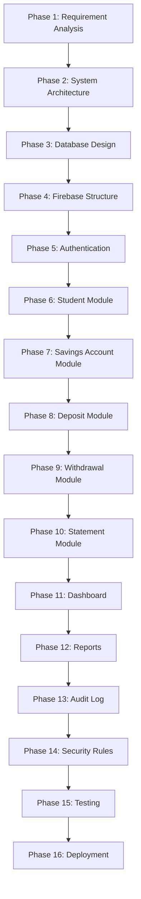

# Bank of School 🏦
### Student Savings Web Application

A production-ready, secure, and auditable student savings web application designed for school environments. Built with a banking mindset, prioritizing immutability, data consistency, and strict transaction controls.

---

## 🛠️ Project Overview

### 👥 Roles & Actor Model
* **👩‍🏫 Teacher (Bank Officer / Accountant):** Manages all student accounts, performs deposits, withdrawals, settings adjustments, and views reports. Has full system access.
* **🎓 Student (Customer):** The end customer. Students **cannot** log into the system; their accounts are entirely managed by the teachers.

### 💻 Technology Stack
| Layer | Technologies |
| :--- | :--- |
| **Frontend** | Next.js 16 (App Router), React, TypeScript, Tailwind CSS |
| **Backend** | Firebase Authentication, Cloud Firestore, Firebase Storage, Firebase Cloud Functions |
| **Security** | Firebase Security Rules, Server-side validation via Cloud Functions |

---

## 📌 Main Features

### 1. Authentication
* **Teacher Login:** Only teachers can access the administration dashboard.
* **Security:** Powered by Firebase Authentication.
* **Features:** Secure login, logout, session tracking, and role management.
* **Extensibility:** Future-ready for multiple accountants.

### 2. Student Management
* **Teacher Capabilities:** Create Student, Edit Student, Soft Delete Student, Disable Student, Search Student.
* **Student Profile Fields:**
  * Student ID
  * Student Number
  * Full Name
  * Class / Room
  * Status (Active / Inactive / Graduated / Transferred)
  * Created & Updated Timestamps

### 3. Savings Account Ledger
* Each student has a corresponding savings account with:
  * Account Number
  * Current Balance
  * Account Status
  * Created Date
  * Last Transaction Timestamp
* > [!IMPORTANT]
  * **Balance calculation rule:** Balance must **never** be calculated or modified by the frontend. It is calculated and verified securely from the backend to prevent balance manipulation.

### 4. Financial Transactions
* Every transaction creates a permanent ledger record:
  * Transaction ID & Unique Reference Number
  * Student & Account Association
  * Transaction Type (Deposit, Withdrawal, Balance Adjustment - Admin Only, Opening Balance, Correction, Void Transaction, Reversal Transaction)
  * Amount, Balance Before, Balance After
  * Transaction Date & Time
  * Created By (Teacher ID)
  * Remark & Status
* **Immutability:** No transaction record is ever physically deleted. Deletion is soft-delete only.

### 5. Bank Statement
* Generate statements resembling standard bank statements.
* **Columns:** Date, Time, Reference, Description, Deposit (+), Withdraw (-), Running Balance, Remark.
* **Features:** Newest/Oldest sorting, Monthly/Yearly statement filters, Print Statement, and export functions.

### 6. Dashboard Metrics
* **General Statistics:** Total Students (Active/Inactive), Today's/Monthly Deposits and Withdrawals, Current Total Savings, Transaction Count, Top Depositors.
* **Charts:** Daily Deposits, Monthly Trends, and Savings Trends.

### 7. Search & Filtering
* Multi-criteria search by: Reference Number, Student ID, Student Name, Transaction Type, Date Range, Amount, Class, Academic Year, and Status.

### 8. Audit Log
* Every important action is logged for accountability.
* **Logged Actions:** Login, Logout, Create/Edit/Delete (Soft Delete) Student, Deposit, Withdraw, Void Transaction, Print Report, Export PDF, Export Excel.
* **Audit Metadata:** User ID, Timestamp, Action Type, Target Document, Old Value, New Value, Remarks, Device, Browser Agent, and IP (if available).

### 9. Security & Access Control
* Protected using Firebase Security Rules.
* Requires user authentication and teacher role-based access.
* Implements server-side validation using Cloud Functions for financial transactions.
* Uses Firestore Transactions to prevent race conditions and double submissions.

---

## 🚨 CRITICAL REQUIREMENTS (MVP VERSION)

The first production release focuses entirely on stability, accounting accuracy, and real-world usability.
> [!WARNING]
> Do NOT implement Enterprise features yet. However, the database architecture must be scalable enough to support future Enterprise features without requiring major database redesign.

### 1. Running Balance 📈
Every transaction must permanently store:
* **Balance Before** (ยอดเงินก่อนหน้า)
* **Transaction Amount** (จำนวนเงินทำรายการ)
* **Balance After** (ยอดเงินหลังทำรายการ)
* *Never calculate historical balances dynamically on the frontend. Historical statements must remain accurate even if future transactions are added.*

### 2. Unique Reference Number 🔢
Every financial transaction must generate a unique, non-duplicable Reference Number.
* *Example Formats:* `DEP2026000001` (Deposit), `WDL2026000001` (Withdrawal).
* Reference Numbers must be searchable.

### 3. Firestore Transaction 🔒
All Deposit and Withdrawal actions must execute within a **Firestore Transaction** or **Cloud Function transaction** to guarantee:
* **Atomic Updates:** Account balance update and ledger creation must succeed together.
* **Concurrency Protection:** Prevent concurrent writes and race conditions.
* **Rollbacks:** Any failure triggers an immediate rollback of all modified documents.

### 4. Immutable Transaction History 🚫
Financial records must never be permanently deleted from the database.
* If a transaction is incorrect:
  1. Mark the original transaction as **Void**.
  2. Create a **Reversal Transaction** to offset the balance.
* The original transaction record remains in history for auditing.

### 5. Prevent Negative Balance 🛑
* **Validation Rule:** If `Withdrawal Amount > Current Balance`, reject the transaction and display a user-friendly error message.
* A savings balance must never fall below zero.

### 6. Double Submission & Lock Protection 🛡️
* **Frontend:** Disable the submit button immediately upon click, display a loading spinner, and prevent multiple clicks or refresh-based re-submissions.
* **Backend:** Validate requests using an **Idempotency Key** or equivalent duplicate-prevention mechanism. Frontend validation alone is **NOT** sufficient.

### 7. Student Soft Delete 🗑️
* Students with financial history cannot be permanently deleted.
* When a teacher removes a student, the system changes their status to `Inactive`, `Graduated`, or `Transferred`.
* Inactive students cannot receive new transactions, but their history must remain accessible in reports.

### 8. Financial Validation Rules ✅
Before executing any transaction, validate:
1. Student profile exists and status is `Active`.
2. Savings account status is `Active`.
3. Amount is a positive number (`Amount > 0`) and is numeric.
4. Withdrawal amount does not exceed the current balance.
5. Transaction date and required fields are valid and not empty.
* *Reject invalid transactions on the server/backend before writing to Firestore.*

### 9. System Configuration ⚙️
Create a `settings` collection to store configurable values:
* Current Academic Year, School Name, Currency, Transaction Prefix, Running Number Format, Statement Header, Report Footer.
* Modifying settings must not require changes to the application code.

### 10. Data Integrity Rules 🛡️
* Account Balance must always equal the latest Running Balance.
* Every transaction must update Account Balance atomically.
* Transactions cannot exist without a valid Student Account.
* Financial records must never be physically deleted.
* Every financial action must generate an Audit Log.
* Every Reference Number must be unique.
* Reports must always match transaction history.
* Historical balances must never change after a transaction is finalized.

---

## 🌟 HIGH PRIORITY FEATURES & REPORTS

### 📅 Monthly Closing
* Support monthly financial closing and store monthly summaries.
* Generate monthly reports without recalculating historical data.
* Future transactions must never modify closed-month reports.

### 📊 Reports & Exports
* **Daily Financial Report:** Opening Balance, Today's Deposits, Today's Withdrawals, Closing Balance, Transaction Count.
* **Classroom Summary:** Group reports by Grade, Class, and Room showing: Number of Students, Total Savings, Total/Average Deposits & Withdrawals.
* **Formats:** Print directly from browser, Export to PDF, and Export to Excel (`.xlsx`).
* **Student Passbook:** Traditional bank passbook layout showing Date, Reference, Description, Deposit, Withdrawal, Running Balance.

---

## 🎯 MVP SCOPE MATRIX

| IN SCOPE (Version 1) | OUT OF SCOPE (Version 2+) |
| :--- | :--- |
| ✓ Authentication & Teacher Management | ✗ Interest Calculation |
| ✓ Student Management & Savings Account | ✗ Parent Notification (LINE / SMS) |
| ✓ Deposit & Withdrawal | ✗ Multiple Branches |
| ✓ Bank Statement & Passbook | ✗ Approval Workflow |
| ✓ Dashboard, Reports & Advanced Search | ✗ Multi-level Roles |
| ✓ Audit Log & Firebase Security Rules | ✗ Advanced Accounting |

*Note: The database and architecture must remain extensible so future versions can add these capabilities without breaking existing data.*

---

## 🗄️ Database Design

We design and structure all collections and schemas with scaling in mind:
* `users` - Teachers and administrative credentials.
* `students` - Student demographic data.
* `accounts` - Savings account ledgers.
* `transactions` - Transaction history.
* `audit_logs` - Audit trails.
* `settings` - System configuration settings.
* `reports` - Pre-calculated summaries and closing reports.
* `counter` - To manage unique sequential transaction reference numbers safely.

---

## 🔄 Development Phases (Workflow)

For each phase, the design must cover:
1. **Goal:** What are we building in this phase?
2. **Business Logic:** Rules, equations, constraints.
3. **UI/UX:** Responsive layouts, Desktop-first design, confirmation dialogs, loading states, skeleton screens, dark mode.
4. **Database & API:** Document schemas and Cloud Function routes.
5. **Security & Validation:** Firestore rules and server-side checks.
6. **Edge Cases & Testing Checklist:** Unit and integration testing criteria.

> [!IMPORTANT]
> **At the end of every phase, wait for approval before proceeding to the next phase.**

---

## 🎨 UI/UX & Coding Standards

### UI/UX Guidelines
* Professional Banking Style
* Responsive (Desktop First)
* Elements: Sidebar, Dashboard, Data Tables with Search, Pagination & Filters, Confirmation Dialogs, Toast Notifications, Loading States & Skeleton screens.
* Dark Mode Ready

### Coding Standards
* Clean Architecture & SOLID Principles
* Reusable components with feature-based folder structure
* TypeScript Strict Mode
* Robust Error Handling & Server-Side Validation
* Zero duplicated code, scalable, and production-ready