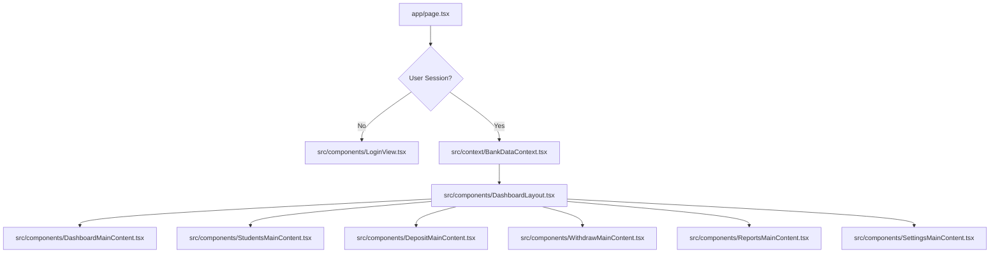

# Refactoring & Fixing Technical Debt (Bank of School) - Phased Plan

This plan outlines the steps to refactor the monolithic `app/page.tsx` (6,277 lines) into clean, modular, and optimized components.

## Goals
1. **Zero UI/Menu Changes**: The user interface, menus, styling, and flow remain 100% identical.
2. **Deduplication of Firestore Listeners**: Reduce redundant `onSnapshot` readers. Currently, 4 separate components query the same `students` and `accounts` collections, causing 4x Firestore reads and visual lag.
3. **Modular File Structure**: Extract sub-views and components into dedicated files inside the `src/` directory.

---

## Proposed Architectural Changes

We will introduce a React Context (`BankDataContext`) that sets up exactly **one** listener for `students` and **one** listener for `accounts` when a teacher logs in. All tabs will share this data, resolving database technical debt and making menu switches instantaneous.

---

## Proposed Phases of Implementation

### เฟส 1: โครงสร้างข้อมูลพื้นฐานส่วนกลาง (Core Infrastructure)
สร้างไฟล์ Utility และ React Context เพื่อใช้แชร์ข้อมูลนักเรียนและบัญชีแทนการดึงข้อมูลแยกแต่ละแท็บ:

* #### [NEW] [bankUtils.ts](file:///h:/05-Physics/Bank-Of-School/src/utils/bankUtils.ts)
  ย้ายฟังก์ชันตัวช่วยจาก `app/page.tsx` มาอยู่ส่วนกลาง:
  * `getLocalDateString()`: จัดรูปแบบวันที่ตามเวลาประเทศไทย
  * `writeAuditLog()`: บันทึกข้อมูลปูมการใช้งานระบบอย่างปลอดภัย
  * `recalculateDashboardSummary()`: คำนวณสรุปยอดออมทรัพย์และสถิติรายวัน

* #### [NEW] [BankDataContext.tsx](file:///h:/05-Physics/Bank-Of-School/src/context/BankDataContext.tsx)
  สร้าง React Context เพื่อเชื่อมโยงฐานข้อมูล:
  * เรียกใช้ `onSnapshot` สำหรับคอลเลกชัน `students` และ `accounts` เพียงจุดเดียว
  * แชร์ข้อมูลผ่าน custom hook `useBankData()` ไปยังทุกหน้าย่อย

---

### เฟส 2: แยกคอมโพเนนต์ฟอร์มและตัวเลือกวันที่ (Common Sub-components)
แยกคอมโพเนนต์ย่อยที่ใช้ร่วมกันออกไปเพื่อความสะดวกในการจัดการ:

* #### [NEW] [DatePicker.tsx](file:///h:/05-Physics/Bank-Of-School/src/components/DatePicker.tsx)
  * แยกตัวเลือกปฏิทินภาษาไทยและฟังก์ชันจัดรูปแบบปฏิทิน
* #### [NEW] [LoginView.tsx](file:///h:/05-Physics/Bank-Of-School/src/components/LoginView.tsx)
  * หน้าเข้าสู่ระบบของคุณครูและส่วนตรวจสอบสิทธิ์ (Authentication Screen)
* #### [NEW] [DashboardLayout.tsx](file:///h:/05-Physics/Bank-Of-School/src/components/DashboardLayout.tsx)
  * โครงสร้างเมนูหลัก (Sidebar, Header, Main Panel) สำหรับการนำทางระหว่างแท็บต่างๆ

---

### เฟส 3: คอมโพเนนต์หน้าธุรกรรมและข้อมูลนักเรียน (Core Transactions & Student Module)
แยกหน้าที่หลักเกี่ยวกับการฝาก-ถอน และข้อมูลนักเรียน:

* #### [NEW] [StudentsMainContent.tsx](file:///h:/05-Physics/Bank-Of-School/src/components/StudentsMainContent.tsx)
  * หน้ารายชื่อนักเรียน ตารางการค้นหา และ CRUD modals (เพิ่ม, แก้ไข, Soft Delete นักเรียน) โดยเปลี่ยนมาดึงข้อมูลจาก `useBankData()`
* #### [NEW] [StudentLedgerView.tsx](file:///h:/05-Physics/Bank-Of-School/src/components/StudentLedgerView.tsx)
  * หน้าแสดง Statement / สมุดบัญชีรายบุคคล และสไตล์ CSS สำหรับการสั่งพิมพ์ (Print Passbook layout)
* #### [NEW] [DepositMainContent.tsx](file:///h:/05-Physics/Bank-Of-School/src/components/DepositMainContent.tsx)
  * หน้าฝากเงิน ระบบตรวจสอบยอด เลขรหัสอ้างอิงรันนิ่งอัตโนมัติ (DEPxxxxxx) และใบเสร็จรับเงิน
* #### [NEW] [WithdrawMainContent.tsx](file:///h:/05-Physics/Bank-Of-School/src/components/WithdrawMainContent.tsx)
  * หน้าถอนเงิน การตรวจเช็คยอดเงินติดลบ/ไม่เพียงพอ ป้องกันการกดเบิ้ล (Double Submission Lock) และใบเสร็จ

---

### เฟส 4: คอมโพเนนต์รายงานและการตั้งค่าระบบ (Reports & Settings Module)
แยกส่วนของรายงานเชิงวิเคราะห์และการตั้งค่าของผู้ดูแลระบบ:

* #### [NEW] [DailyReportView.tsx](file:///h:/05-Physics/Bank-Of-School/src/components/DailyReportView.tsx)
  * หน้าสรุปยอดธุรกรรมประจำวัน และปุ่มดาวน์โหลดไฟล์ CSV (Export to Excel)
* #### [NEW] [ClassroomSummaryView.tsx](file:///h:/05-Physics/Bank-Of-School/src/components/ClassroomSummaryView.tsx)
  * หน้ารายงานสรุปยอดการออมแยกตามห้องเรียน
* #### [NEW] [ReportsMainContent.tsx](file:///h:/05-Physics/Bank-Of-School/src/components/ReportsMainContent.tsx)
  * แท็บควบคุมการดูรายงานทั้งหมด
* #### [NEW] [SettingsMainContent.tsx](file:///h:/05-Physics/Bank-Of-School/src/components/SettingsMainContent.tsx)
  * แท็บตั้งค่าสถาบัน, รายชื่อเจ้าหน้าที่ (Staff Management), System Logs และตัวรันทดสอบ QA Test Runner

---

### เฟส 5: ปรับปรุงหน้า Router หลักและตรวจสอบความถูกต้อง (Integration & Verification)
ขั้นตอนสุดท้ายในการเชื่อมต่อระบบและทดสอบ:

* #### [MODIFY] [page.tsx](file:///h:/05-Physics/Bank-Of-School/app/page.tsx)
  * เคลียร์โค้ดเดิมทั้งหมดใน `app/page.tsx` เหลือเพียง Router เบาๆ ที่ครอบด้วย `<BankDataProvider>` และดึงโมดูลแท็บต่างๆ มาแสดงผล
* #### **การตรวจรับความถูกต้อง (Verification)**:
  * รันทดสอบระบบผ่าน Test Runner QA Checklist (100% Pass)
  * ทดสอบฟังก์ชันฝาก-ถอน และพิมพ์เอกสารว่าทำงานได้เหมือนเดิมและมี Audit log บันทึกครบถ้วน
  * ตรวจสอบว่าสวิตช์เมนูแล้วรวดเร็วขึ้น ไม่มีปัญหากล่องสั่น/โหลดซ้ำ

---

## Verification Plan

### Automated Tests
Run the embedded system checklists in the **Test Runner (QA / Test Checklist)** tab inside the app settings menu to confirm:
* Security Rules validation.
* Mathematical core accuracy.
* Concurrency checks (Race condition protections).
* UI Locks (Double submission checks).

### Manual Verification
* Perform a mockup deposit & withdraw on a test student and verify that calculations reflect correctly and create the audit log.
* Switch menus and verify no network flickering/loading spinners.
* Inspect that the styling, menus, layout elements, and copy are 100% identical.
